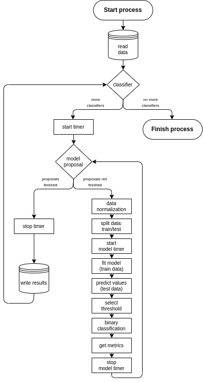

# Does Machine Learning outperform Logistic Regression in predicting individual tree mortality? 

### :computer: :floppy_disk: :bar_chart: *Original data, code and results related to the study*

---

:bulb::brain: ***Each file and/or folder code corresponds to the script used to generate it, ensuring that all (dataset + script + output) share the same code***

:warning: :scroll: ***Remember to update the script paths in your working directory if you plan to use that code***

---

## :file_folder: Folder Content

- :scroll: ***0_data_curation.r***
  - :bulb: *Purpose*:
    Manage initial data: structure, IDs, input missing data.
  - :floppy_disk: :arrow_right: :computer: *Input*:
    `1_raw/final/VF_daten.xlsx`, `1_raw/final/Fi-Daten__age.xlsx`
  - :computer: :arrow_right: :floppy_disk: *Output*:
    `1_processed/0_initial_df_clean/initial_df_clean.csv`

- :scroll: ***1.0_neighborhood_main.r***, ***1.1_neighborhood_functions.r***
  - :bulb: *Purpose*:
    Calculate variables needed for the analysis using a subplot of 0.33*h radii around each tree.
  - :floppy_disk: :arrow_right: :computer: *Input*:
    `1_data/1_processed/0_initial_df_clean/initial_df_clean.csv`
  - :computer: :arrow_right: :floppy_disk: *Output*:
    `1_data/1_processed/1_neighborhood/*`, `trees_r33.csv`, `subplot_stats_r33.csv`, `neighborhood_stats_r33.csv`

- :scroll: ***2_climate_data.r***
  - :bulb: *Purpose*:
    Calculate climate variables by plot location. :warning: *Requires prior download of climate data from WorldClim, contact authors for details if needed.*
  - :floppy_disk: :arrow_right: :computer: *Input*:
    `1_raw/final/Koordinaten.xlsx`
  - :computer: :arrow_right: :floppy_disk: *Output*:
    `1_data/1_processed/2_clima/df_complete_r33.csv`

- :scroll: ***3_feature_visualization.r***
  - :bulb: *Purpose*:
    Generate graphs and manually study variable relationships.
  - :floppy_disk: :arrow_right: :computer: *Input*:
    `1_data/1_processed/2_clima/df_complete_r33.csv`
  - :computer: :arrow_right: :floppy_disk: *Output*:
    None

- :scroll: ***4.0_split_dataset.r***, ***4.1_split_variables.r***, ***4.2_functions_var_combis.r***
  - :bulb: *Purpose*:
    Split datasets (size and thinning) and variables for case studies.
  - :floppy_disk: :arrow_right: :computer: *Input*:
    `1_data/1_processed/2_clima/df_complete_r33.csv`
  - :computer: :arrow_right: :floppy_disk: *Output*:
    `1_data/1_processed/4_datasets/*`

- :scroll: ***5.0_run_analysis.r***, ***5.1_LR_analysis.r***, ***5.2_DT_analysis.r***, ***5.3_RF_analysis.r***, ***5.4_NB_analysis.r***, ***5.5_KNN_analysis.r***, ***5.6_SVM_analysis.r***
  - :bulb: *Purpose*:
    Run analysis (except ANN) in R for different case studies.
  - :floppy_disk: :arrow_right: :computer: *Input*:
    `1_data/1_processed/4_datasets/*`
  - :computer: :arrow_right: :floppy_disk: *Output*:
    `1_data/1_processed/5_analysis/**case_study**/*`, `metrics.RData`, `models.RData`

- :scroll: ***6_HPC***
  - :bulb: *Purpose*:
    Run simulations on iuFOR HPC, split by study case.
  - :floppy_disk: :arrow_right: :computer: *Input*:
    `1_data/1_processed/4_datasets/*`
  - :computer: :arrow_right: :floppy_disk: *Output*:
    `1_data/1_processed/5_analysis/**case_study**/*`, `metrics.RData`, `models.RData`

- :scroll: ***7_metrics_compilation.r***
  - :bulb: *Purpose*:
    Extract R analysis metrics and create a checkpoint.
  - :floppy_disk: :arrow_right: :computer: *Input*:
    `1_data/1_processed/5_analysis/*`, `**case_study**/metrics.RData`, `ann/preds/**case_study**/*`, `ann/timer/**case_study**/*`
  - :computer: :arrow_right: :floppy_disk: *Output*:
    `1_data/1_processed/6_final_results/**case_study**/final_metrics.RData`

- :scroll: ***8.0_performance_graphs.r***, ***8.1_functions_performance_graphs.r***, ***8.2_classifiers_comparison.r***, ***8.3_graph_functions.r***, ***8.4_application_thinning.r***, ***8.5_application_thinning_comparison.r***, ***8.6_time_and_performance_graphs.r***
  - :bulb: *Purpose*:
    Compare analysis metrics across case studies using graphs. Graphs in the original paper use *8.5* and *8.6*.
  - :floppy_disk: :arrow_right: :computer: *Input*:
    `1_data/1_processed/6_final_results/**case_study**/final_metrics.RData`
  - :computer: :arrow_right: :floppy_disk: *Output*:
    `2_scripts/4_figures/*`

- :scroll: ***9.0_location_map.r***, ***9.1_neighbour_graphs.r***, ***9.2_mortality_graphs.r***, ***9.3_df_mortality_rates.r***, ***9.4_paper_tables.r***
  - :bulb: *Purpose*:
    Generate graphs (location, neighborhood) and obtain tables for the original paper.
  - :floppy_disk: :arrow_right: :computer: *Input*:
    `1_raw/final/Koordinaten.xlsx`, `1_data/1_processed/2_clima/df_complete_r33.csv`, `1_data/1_processed/1_neighborhood/trees_r33.csv`
  - :computer: :arrow_right: :floppy_disk: *Output*:
    `2_scripts/4_figures/*`

---

## :books: Additional Information

A flowchart detailing the training and testing process (*scripts from groups 5 and 6*) is shown here: 

